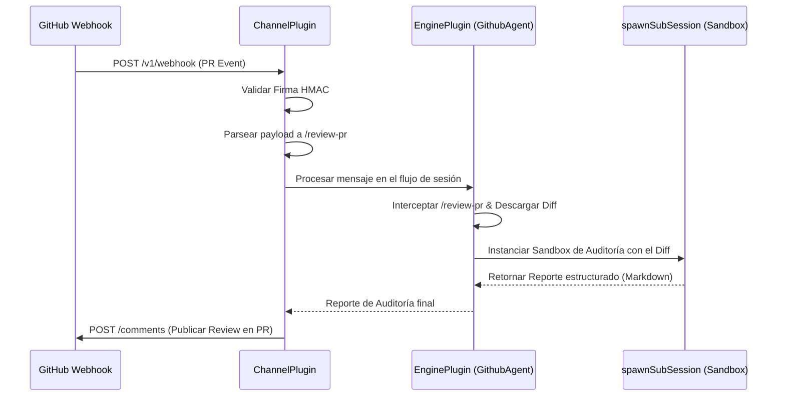

<div align="center">
  
  
  # 🐙 GitHub Agent — Urano Hybrid MCP & Channel Plugin

  [](https://github.com/uranotools/UranoDesktop)
  [](https://github.com/uranotools/GithubAgent)
  [](https://opensource.org/licenses/MIT)

  **El agente de desarrollo definitivo para auditar Pull Requests y responder a Issues en GitHub de manera 100% automatizada e inteligente.**

  *Perfectamente integrado como Channel Webhook Provider para recibir eventos y Engine Plugin para ejecutar revisiones de código aisladas en Sandbox.*
</div>

---

## ✨ Capacidades

| Evento de GitHub | Acción en Urano | Descripción |
|-----------------|-----------------|-------------|
| **Pull Request (Opened / Sync)** | Auto-Review | Descarga el diff de código, inyecta el sandbox y genera la revisión en Markdown. |
| **Issue Comment** | Conversacional | Responde dudas o consultas directas de desarrolladores en hilos de Issues. |
| **PR Review Comment** | Conversacional | Interactúa en las líneas específicas de código en revisión. |
| **Firma Webhook** | Seguridad | Valida firmas HMAC-SHA256 (`x-hub-signature-256`) antes de procesar cualquier evento. |

**Arquitectura Cero-Bucles:** El plugin ignora automáticamente comentarios realizados por bots y por sí mismo para prevenir bucles infinitos de procesamiento en GitHub.

---

## ⚡ Arquitectura Híbrida Premium

Este plugin combina el nuevo sistema de **Channel Plugins** (webhooks entrantes) y **Engine Plugins** (middlewares de ejecución) para crear un flujo de revisión de código automatizado y seguro:



### Beneficios del Enfoque Híbrido:
1. **Sandboxing de Ejecución (`spawnSubSession`)**: La revisión de código compleja se corre en un hilo de razonamiento aislado. Los "pensamientos" y ejecuciones intermedias del modelo no ensucian ni saturan el historial del chat principal.
2. **Badges Dinámicos Interactivos**: Al recibir un evento de GitHub, el cliente de Urano renderiza de forma premium el repositorio origen (`🐙 owner/repo`) y el identificador (`PR #12` o `Issue #34`) en la barra del chat del agente.
3. **Optimización de Contexto**: El plugin descarga el diff del Pull Request en tiempo real y trunca el texto inteligentemente si este excede los límites físicos de tokens, garantizando que el LLM nunca falle por desbordamiento de contexto.

## 🔌 Contratos de Entrada y Salida (E/S)

El plugin funciona como un transductor entre la API de Webhooks de GitHub y el motor conversacional de Urano. A continuación se detallan las interfaces y payloads de entrada/salida.

### 📥 1. Entrada: Webhooks de GitHub (Input)
El endpoint expuesto por Urano recibe las notificaciones de eventos directamente desde GitHub.

#### Cabeceras Esperadas
* `x-github-event`: Tipo de evento de GitHub (`pull_request`, `issue_comment`, `pull_request_review_comment`).
* `x-hub-signature-256`: Firma HMAC-SHA256 del payload (validada si `GITHUB_WEBHOOK_SECRET` está configurado).

#### Eventos y Payload Soportados
* **Pull Request** (`pull_request`):
  * **Acciones**: `opened` (creado) o `synchronize` (nuevos commits / actualizaciones).
  * **Campos clave**: `pull_request.diff_url`, `pull_request.title`, `pull_request.body`, `number`, `repository.full_name`.
* **Comentarios en Issues o PRs** (`issue_comment`, `pull_request_review_comment`):
  * **Acciones**: `created`.
  * **Campos clave**: `comment.body`, `issue.number` (o `pull_request.number`), `repository.full_name`.

#### 🛡️ Filtro de Descarte
Para evitar bucles infinitos de agentes comentando sobre sí mismos, se descarta silenciosamente (retornando `{ from: '', text: '' }`) cualquier webhook cuyo emisor (`sender`):
* Sea de tipo `Bot`.
* Tenga un login que contenga `[bot]` o la palabra `urano` (case-insensitive).

---

### 📤 2. Salida al Core: Parsed Message
Tras parsear el webhook, el plugin emite un objeto estructurado `ParsedMessage` al Core de Urano:

| Evento Original | Formato del `from` (Identificador de Sesión) | Formato del `text` (Mensaje para el Agente) |
| :--- | :--- | :--- |
| **Pull Request** | `github:<owner>/<repo>/pull/<prNumber>` | `/review-pr <diff_url> <titulo_pr>\n\n<descripcion>` |
| **Comment** | `github:<owner>/<repo>/(pull\|issue)/<number>` | `<cuerpo_del_comentario>` |

> [!NOTE]
> El identificador `from` es el que el Core de Urano utiliza como `chatId` para recuperar o inicializar el contexto de la sesión. Todos los webhooks que compartan el mismo `from` irán al mismo hilo conversacional.

---

### ⚙️ 3. Acciones de Canal y MCP (Salidas al LLM / Respuestas)
El plugin expone capacidades de comunicación y lectura que el LLM puede invocar en cualquier momento:

#### `sendReply` (Publicar comentario)
* **Destinatario (`to`)**: Identificador de sesión con formato `github:<owner>/<repo>/(pull|issue)/<number>`.
* **Mensaje (`text`)**: El contenido del comentario en Markdown.
* **Acción**: Realiza un `POST` al endpoint de la API de GitHub:
  `https://api.github.com/repos/{owner}/{repo}/issues/{number}/comments`

#### `getIssueDetails` (Leer detalles de Issue/PR)
* **Parámetros**: `{ owner, repo, number, type }`
* **Acción**: Realiza un `GET` del Issue/PR y obtiene los metadatos básicos junto con los últimos 5 comentarios para dar contexto histórico al agente.

#### `listPRFiles` (Listar archivos de un PR)
* **Parámetros**: `{ owner, repo, pull_number }`
* **Acción**: Consulta los archivos afectados por el Pull Request para que el agente sepa qué archivos inspeccionar en detalle.

---

## 🚀 Instalación en Urano

### Modo Desarrollador (Dev Mode — Recomendado)

1. Abre **Urano Desktop → MCP Manager → Pestaña "Desarrollador"**.
2. Haz clic en **"Vincular Carpeta Local"**.
3. Selecciona esta carpeta (`GithubAgent/`).
4. Urano creará un symlink local y activará la recarga en caliente automática.

### Instalación desde ZIP (Producción / Marketplace)

1. Instala las dependencias necesarias para la compilación:
   ```bash
   npm install
   ```
2. Compila el bundle de producción:
   ```bash
   npm run deploy
   ```
3. Ejecuta la tarea de empaquetado para generar el archivo de distribución:
   ```bash
   npm run urano-launch
   ```
4. En **Urano → MCP Manager → Instalar MCP (.zip)**, sube el archivo `urano-github-agent.zip` generado en el directorio raíz.

---

## ⚙️ Configuración

Una vez instalado, ve a **MCP Manager → GithubAgent → Configuración** y completa los secretos en tu Bóveda local:

| Campo | Tipo | Descripción |
|-------|------|-------------|
| `GITHUB_PAT` | 🔒 Password (Bóveda) | Tu **Personal Access Token** de GitHub con permisos de escritura (`repo` o `write:discussion`). |
| `GITHUB_WEBHOOK_SECRET` | 🔒 Password (Bóveda) | Secreto opcional configurado en tu webhook de GitHub para asegurar que el tráfico sea auténtico. |

### 🌐 Configuración del Webhook en GitHub

1. En tu repositorio de GitHub, ve a **Settings → Webhooks → Add webhook**.
2. Configura los siguientes campos:
   * **Payload URL**: 
     * *Local/Dev (usando ngrok)*: `https://<tu-ngrok-subdominio>.ngrok-free.app/v1/webhook/mcp_githubagent/chan_test`
     * *Cloud/Nube*: `https://api.urano.cloud/v1/webhook/mcp_githubagent/[ID_CANAL]`
   * **Content type**: `application/json`
   * **Secret**: El mismo texto ingresado en `GITHUB_WEBHOOK_SECRET`.
   * **Which events?**: Selecciona *Let me select individual events* y marca:
     * `Pull requests`
     * `Issue comments`
     * `Pull request reviews` (opcional)

---

## 🏗️ Estructura del Proyecto

```
📁 GithubAgent/
├── 📄 config.ts                         ← Manifiesto de registro Híbrido
├── 📄 SKILL.md                          ← Guía de personalidad para revisiones del agente
├── 📄 package.json                      ← Dependencias y scripts de construcción
├── 📄 tsconfig.json                     ← Configuración de TypeScript
├── 📄 urano.d.ts                        ← Definiciones de interfaces del Core
├── 📄 urano-github-agent.zip            ← Archivo de distribución del plugin
└── 📁 Plugins/
    ├── 📁 Channel/
    │   └── 📄 ChannelPlugin.ts          ← Enrutador de Webhooks y API REST de GitHub
    └── 📁 Engine/
        └── 📄 GithubAgentEnginePlugin.ts ← Middleware de revisión autónoma (Sandbox)
```

---

## 📋 Requisitos

- **Urano Desktop** o **Cloud** ≥ 2.1.0
- **Node.js** ≥ 18 (solo para compilar)
- **GitHub Personal Access Token** con permisos de escritura de comentarios
- Conexión a internet para interactuar con la API REST de GitHub (`https://api.github.com`)
